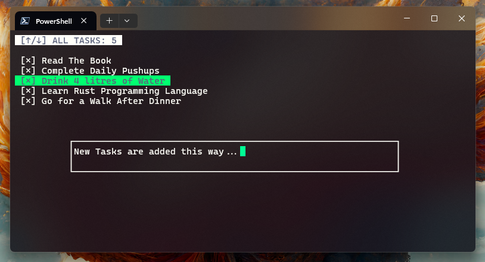

### Rusted Tasks: A CLI todo-list app written in Rust
A CLI todo-list app written in Rust. Uses [Pancurses](https://crates.io/crates/pancurses) for UI rendering.

### How to use

1. Clone the repository.
2. Execute the `cargo build --release` to obtain the `rusted-tasks.exe` file.
3. Locate the exe file in the `target/release/` directory.
4. Run the exe file from your preferred terminal.

> I recomment adding the `rusted-tasks.exe` file to your PATH for easy access.

#### Keybindings

Task Management
* `shift + a` : Add a new task
* `shift + d` : Delete a task
* `shift + t` : Toggle status
* `shift + s` : Save tasks
* `shift + q` : Save and Quit 

Navigation
* `k` or `j`  : Move up or down
* `↑` or `↓`  : Move up or down

#### Command line args

1. `-h` : Show help message. `rust rusted-tasks -h`
2. `-a` : Add a new task. `rusted-tasks -a "task message"`